# What's Different in RetroInk

Everything you love about [CrossInk](https://github.com/uxjulia/CrossInk), its reading engine, library, transfer, dictionary, and synchronization features, now with a full System 6 retro redesign, a reimagined stats dashboard, a real library, Focus Session reading goals, and Obsidian clip syncing. This page covers that RetroInk-specific delta. For the full feature set RetroInk inherits from CrossInk, see the dropdown near the bottom of this page.

## Retro UI

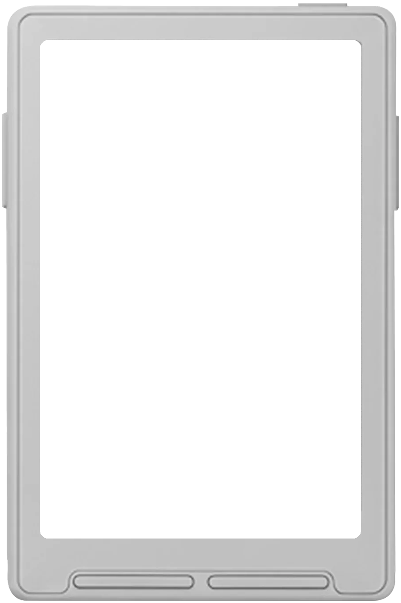
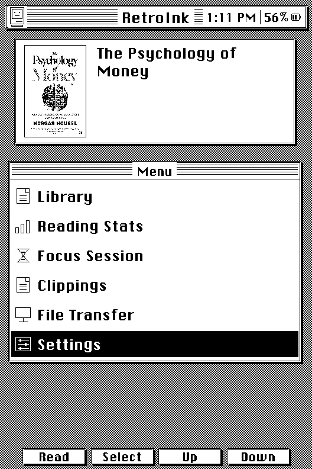

A full System 6 theme, not a palette swap: striped title bars, square controls, inverted-selection lists, and a checkerboard desktop texture cover every window, menu, dialog, and progress bar. The boot sequence is a small pixel-drawn Macintosh whose eyes shift left, right, then center across three redraws, and the default sleep screen is that same Mac, asleep, with "RetroInk is resting between chapters."

None of it costs extra memory. The whole theme adds no additional state to the renderer, and every piece of chrome, windows, icons, the hourglass, drop-shadowed keycaps, is drawn with line and rectangle primitives straight into the existing single 1-bit framebuffer at render time. No second framebuffer, no decoded bitmaps, no stored animation frames. It's available as its own selectable theme in **Settings > Display > UI Theme**, so it doesn't change anyone's existing setup by default.

Pick your sleep screen from three playful Mac-style dialogs in **Settings > Display > Sleep Screen**, on top of the plain "resting between chapters" default:

  

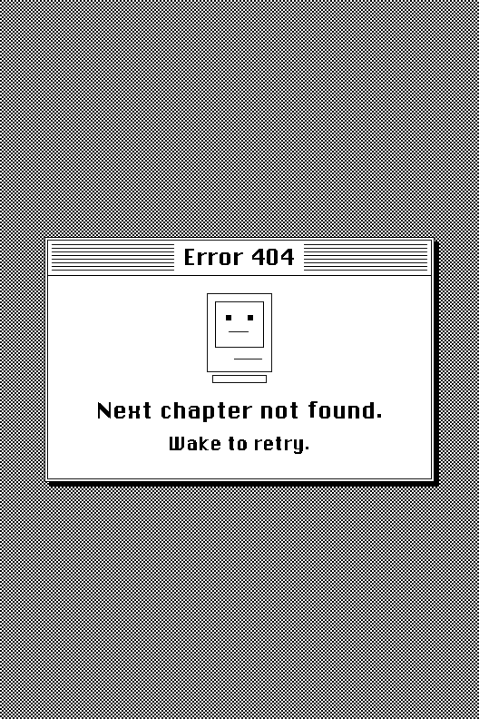

  

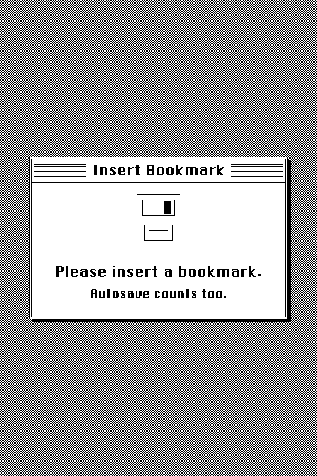

  

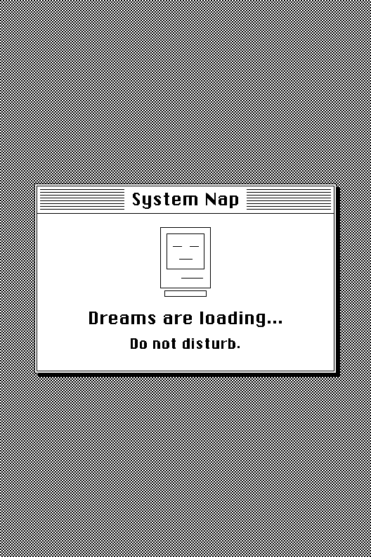

## Stats Dashboard

  

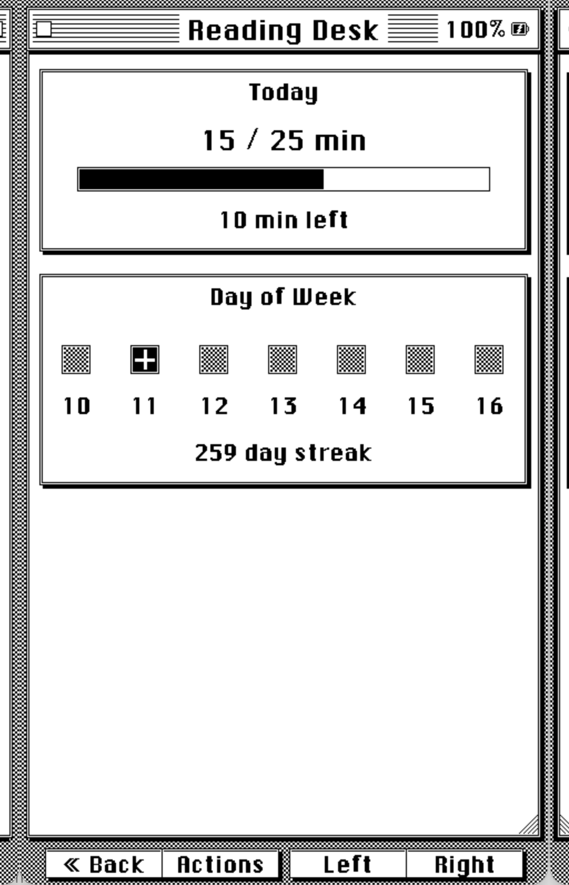

  

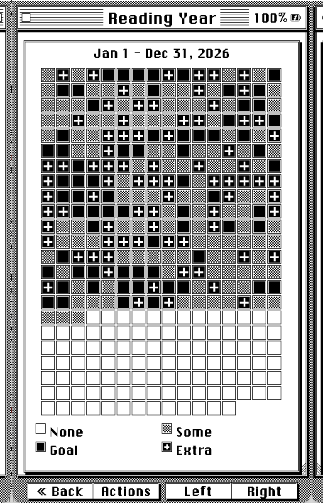

Reading stats get a dedicated set of themed pages when the System 6 theme is active:

- **Today**, a reading-goal progress bar, a 7-day strip showing which days you hit your goal, and your current streak.
- **Reading Year**, a full year-long grid, one cell per day, in the same style as a GitHub contribution calendar, rendered as Mac icon tiles.
- **Book Status**, per-book progress, total time read, pages turned, and estimated time remaining.

## Reading Goal

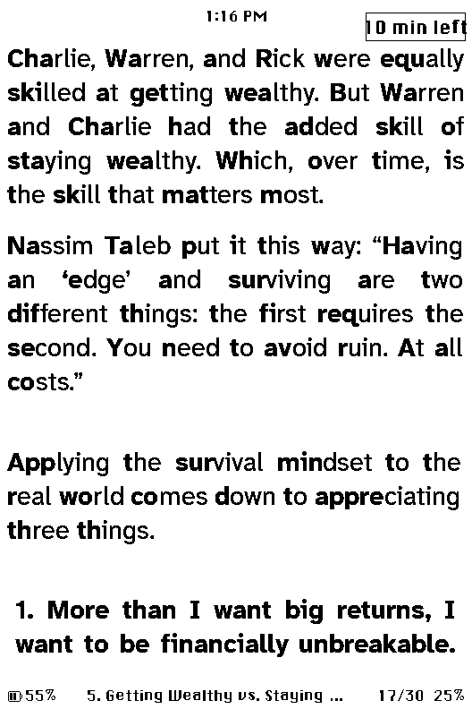

CrossInk doesn't have reading goals at all; this is new in RetroInk and it's what the Today and streak views above are actually tracking. Set one in **Settings > System > Daily Reading Goal** (5 to 180 minutes), then turn on **Reader Goal Countdown** in that same System settings screen. Once it's on, a small badge in the top-right corner of the reading screen counts down your remaining minutes for the day, no need to leave the book or open the stats screen to check.

## Real Library

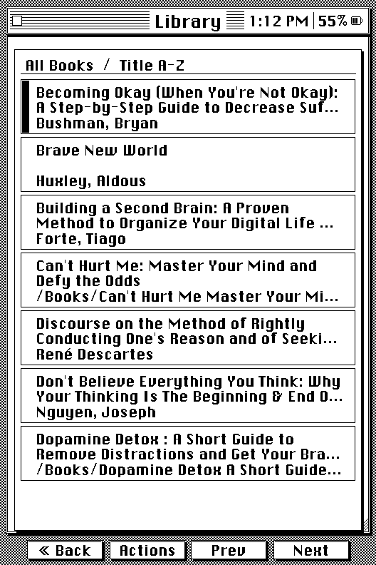

A proper library, not a flat file list: shelves for **To Read, Reading, Finished, and Favorites**, four sort modes (Title, Filename, Author, Recent), and an A-Z jump list. It's backed by an SD-side catalog, not an in-RAM list, built to hold thousands of books on the X3/X4's limited memory, and it scans your folders incrementally instead of blocking on a full rescan. Move or rename a book on the SD card yourself, and RetroInk reconciles the catalog entry instead of treating it as a new, unread book.

## Custom Shelves

Beyond the built-in To Read/Reading/Finished/Favorites categories, you can now create your own named shelves and sort books into them however you like, a reading queue for a book club, a "borrowed" shelf, whatever makes sense for your library. Create and manage them from the web file transfer portal's new **Library** tab, drag and drop books between shelves (works with touch too), or from the device itself.

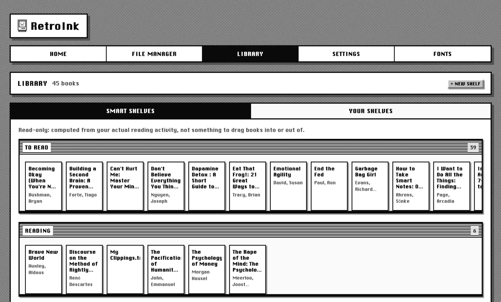

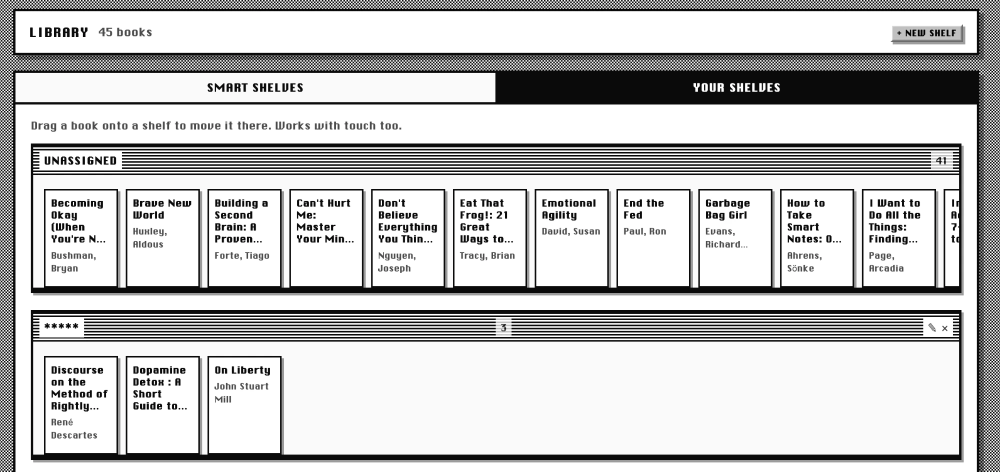

On the device, Library browsing is a redesign from the ground up: books are drawn as spines standing on a shelf, and the front buttons map the way you'd actually browse a physical shelf. Left and Right page through the books on the current shelf; Up and Down switch straight to the next or previous shelf, built in or custom, no menu in the way. Pull up Actions and set whichever shelf you're looking at as the one Library opens to by default.

## Charging Screen

An optional System 6-styled screen that appears automatically when you plug in the charger and aren't actively reading, in place of whatever was on screen. Toggle it in **Settings > Display > Charging Screen**.

## Focus Session

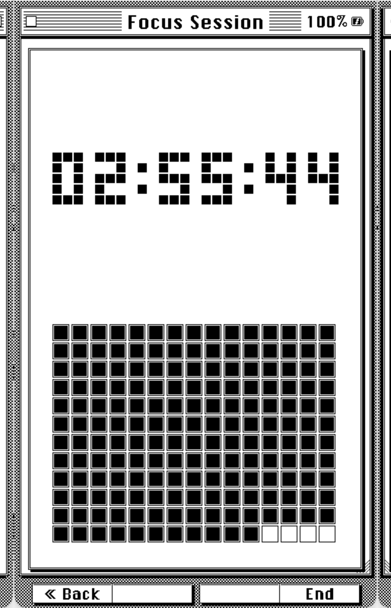

A configurable reading-session timer, reachable from Home:

- Session length from 5 minutes to 24 hours, in 5-minute steps.
- Choose how often the countdown redraws, every second, every minute, or every 5 minutes, to trade responsiveness for e-ink refreshes and battery.
- Wi-Fi turns off for the duration of a session.
- The countdown checkpoints itself roughly once a minute, so a session survives the device sleeping and waking mid-session with an accurate time remaining, not a reset clock.
- The **Reading Desk** (opened from the stats screen) is the hub for all of this: start a session, edit your session length, and jump into the streak and year-grid views above, plus your Reading Goal.

## Obsidian Clipping Sync

Pushes the highlights you save while reading straight into an Obsidian vault, over your local network via Adam Coddington's [Local REST API with MCP plugin](https://github.com/coddingtonbear/obsidian-local-rest-api), or to any webhook. On top of, not instead of, the existing `/My Clippings.txt` export. See the [full guide](./obsidian-sync.html).

## Web Portal

The on-device web portal, what loads in your browser when you connect over Wi-Fi in File Transfer mode, gets the same System 6 treatment as the device: the checkerboard desktop texture, striped title bars, beveled buttons, and the same UI font the reader itself uses. It's not a reskin over the old layout either; pages now span the full width of your browser window instead of floating in a fixed centered column, and the Library tab mirrors the device: Smart Shelves and Your Shelves as switchable tabs, with drag-and-drop between shelves.

## What changed or was removed

RetroInk isn't purely additive. A few things from stock CrossInk work differently or aren't there anymore:

- **Recent Books** is no longer its own Home menu entry. Library's Recent sort covers the same ground, and the Home book panel still lets you jump back into whatever you were last reading.
- The **Files** shortcut is hidden from Home by default now that Library is the primary way to browse books. It's one setting away from coming back, in **Settings > System > Files & Cache** or via the web settings API.

## Everything CrossInk already does

RetroInk keeps all of this from CrossInk. Click to expand the full list.

- New reader fonts: Lexend Deca and Bitter.
- Unicode emoji and miscellaneous symbols support (a limited subset).
- Reader font sizes: 10 pt, 12 pt, 14 pt, and 16 pt.
- Strikethrough support, and thicker underlines for better visibility.
- A custom Minimal theme and sleep screen option.
- A custom Dashboard theme and sleep screen option.
- Support for `
` section breaks and "redaction" style rendering.
- Improved support for tables with simple markup.
- Bookmarks, and front-button remapping that only applies in the reader.
- Bionic Reading and Guide Dots as optional reader modes.
- Force Paragraph Indents, for books that render as one giant wall of text.
- Pin a sleep image as a favorite.
- Extra in-reader control remapping for side buttons, short power-button clicks, and long-press menu actions.
- Mark a book as finished from the in-book menu, and move finished books to a "Read" folder.
- An in-book menu to adjust reader options without leaving the book.
- Reading stats: total books read, total reading time, sessions, pages turned, average session time, pages turned per minute.
- All-time reading stats syncing between two CrossInk-family devices.
- Reading progress sync between two CrossInk-family devices.
- Customizable Auto Page Turn Interval (5 to 120 seconds).
- Safe book moves across the device, web file manager, and WebDAV, with reading-record recovery after a move made elsewhere.
- Nearby file transfer, OPDS browsing, dictionary lookups, and Calibre wireless transfers.

## License

RetroInk is released under the same [MIT License](https://github.com/smashedllama/retroink/blob/main/LICENSE) as the CrossInk project it's forked from. RetroInk's own modifications are MIT-licensed too.

## Not affiliated

RetroInk is an independent community project. It is not affiliated with or endorsed by Apple, Xteink, or the CrossInk project.
